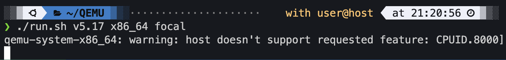
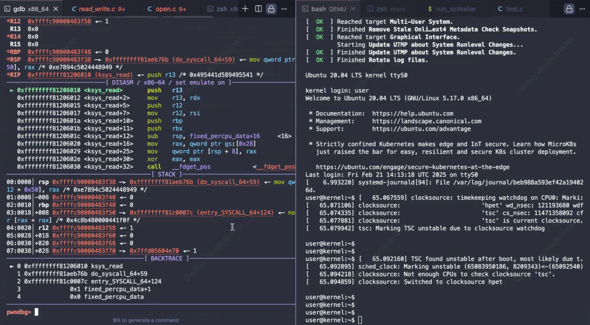
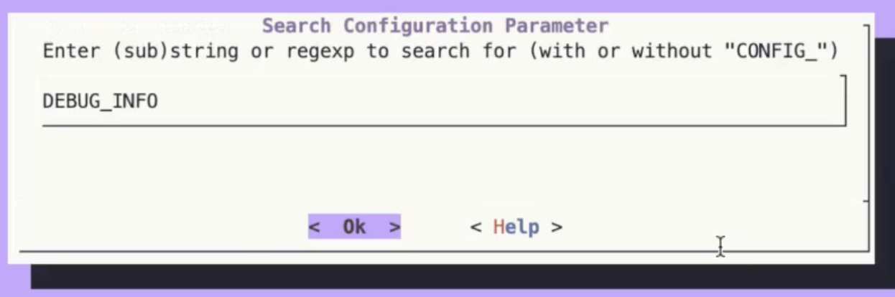
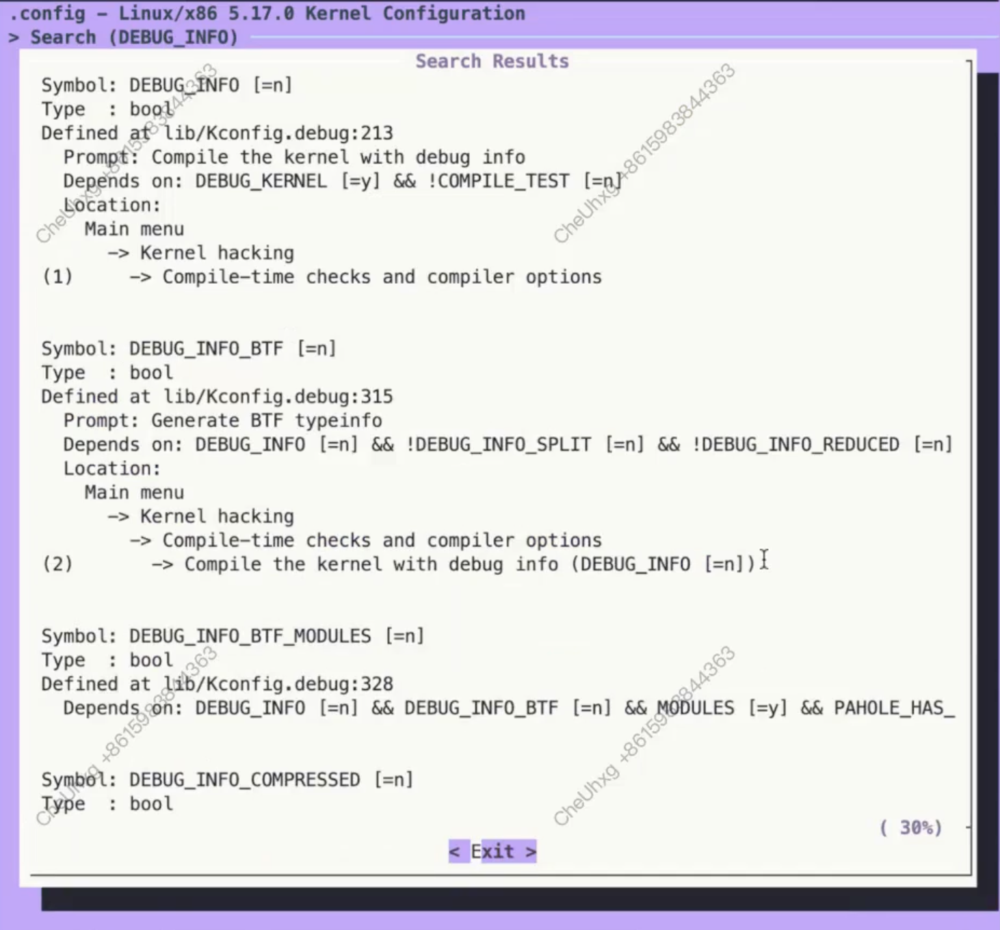
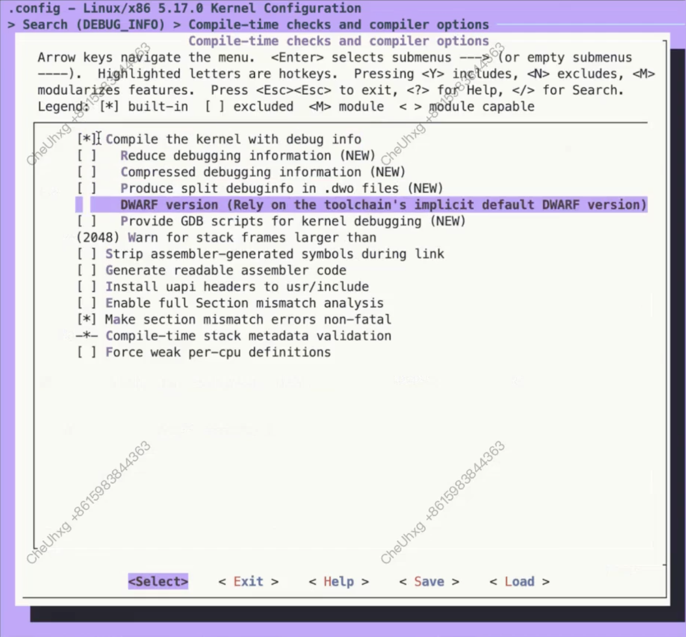
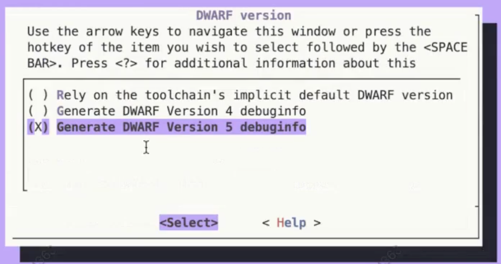

# 内核调试

成功编译运行内核（见[setup](./setup.md)）之后，接下来我们使用gdb来调试内核。

## QEMU参数设置

查看~/WorkSpace下的run.sh，可以看到运行QEMU的命令：

``` bash
qemu-system-x86_64 \
    -snapshot \
    -enable-kvm \
    -s -S \
    -m 4G \
    -smp 1 \
    -kernel ${KERNEL} \
    -append "nokaslr console=ttyS0 root=/dev/sda earlyprintk=serial net.ifnames=0" \
    -drive file=${HDA},format=raw \
    -nographic \
    -net user,host=10.0.2.10,hostfwd=tcp:127.0.0.1:10021-:22 \
    -net nic,model=e1000 \
    -fsdev local,security_model=passthrough,id=fsdev0,path=${LINUX} \
    -device virtio-9p-pci,id=fs0,fsdev=fsdev0,mount_tag=hostlinux \
    -fsdev local,security_model=passthrough,id=fsdev1,path=${SHARE} \
    -device virtio-9p-pci,id=fs1,fsdev=fsdev1,mount_tag=hostshare \
    -pidfile vm.pid \
    2>&1 | tee vm.log
```

* 其中`-s`等价于 -gdb tcp::1234，即在默认的 TCP 端口 1234 上启动一个 gdb 服务器。
这允许用户通过 gdb 连接到 QEMU 实例进行调试。
* `-S`表示在启动时暂停虚拟机的 CPU。
这通常与 -s 一起使用，方便在虚拟机启动前通过 gdb 连接并设置断点。

当我们添加`-s`参数时，QEMU运行内核后就可以通过gdb远程连接了。

## 运行演示

启用`-s -S`后运行run.sh，可以看到QEMU在等待gdb连接：



运行脚本debug.sh（替换{target_function}为你想断点停下的内核函数）：

``` bash
gdb vmlinux \
    -ex "target remote:1234" \
    -ex "b {target_function}" \
    -ex "c"
```

把{target_function}设置为ksys_read之后运行内核：



在左下角我们可以看到，内核在Breakpoint 1，也就是ksys_read的断点处停下了。这是因为运行的内核时刻有进程在调用该函数，触发了断点。

但是当前内核没有调试信息，导致我们在断点停下后无法看到对应的源码信息。这时候我们需要为内核添加调试信息，即给内核添加CONFIG_DEBUG_INFO编译选项。

在宿主机中的源码目录下，执行make menuconfig打开图形化配置内核编译选项：


进入后输入`/`开启搜索模式，然后输入DEBUG_INFO后回车：





按(1)进入后按空格打开选项：



回车进入DWARF版本配置项后，选择`Generate DWARF Version 5 debuginfo`，空格启用：



最后我们连按Esc退出并保存即可。

之后我们重新编译内核，此时内核就有调试信息了。