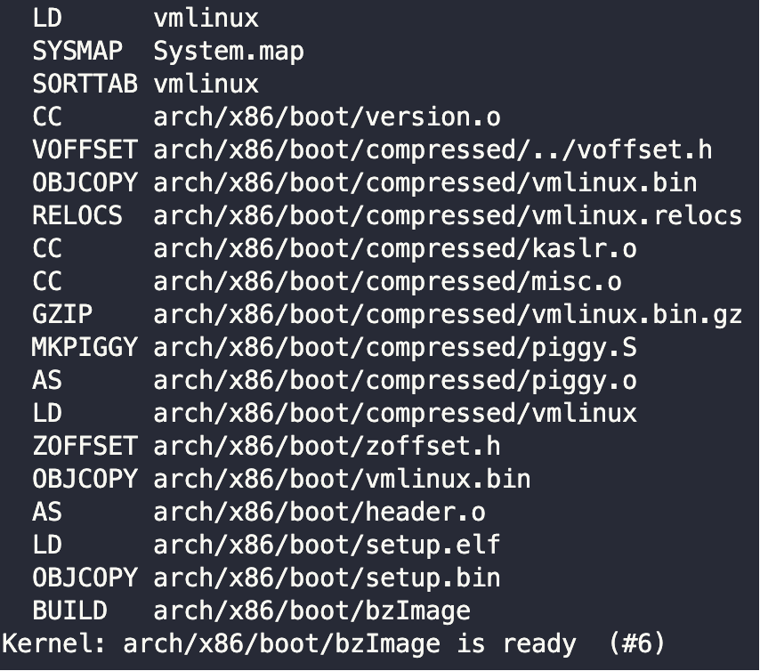
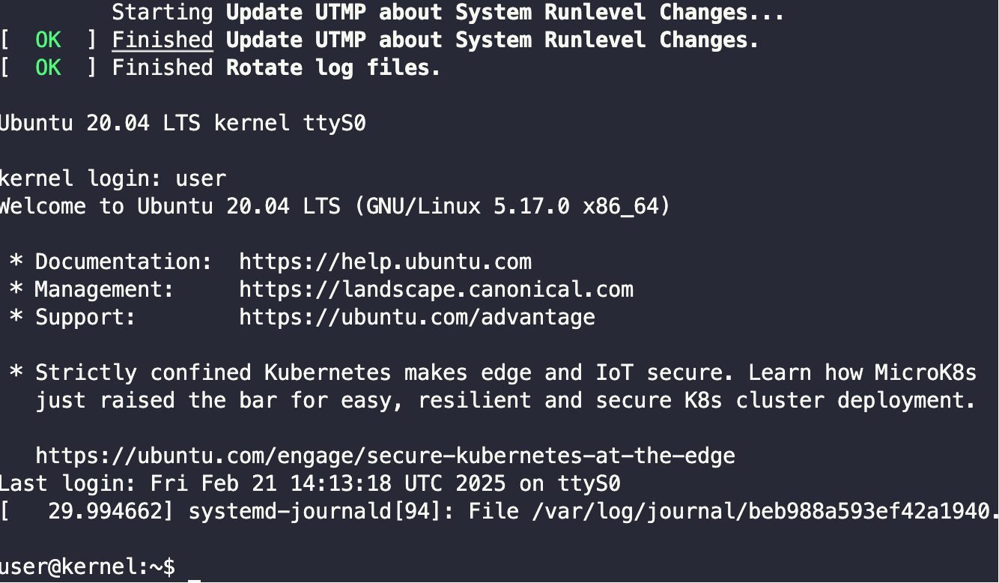

# 环境搭建

## VMware

* [vmware云盘链接](https://pan.ruc.edu.cn/link/AAC2DAE7A9334149F9913389186D7694B1)

请下载链接中的LinuxKernel压缩包，解压后找到ovf文件，参考[VMware导入ova/ovf虚拟机文件](https://blog.csdn.net/Highlight_Jin/article/details/138542710)。

## Ubuntu宿主机

目录结构（Host）
* ${HOME}/Kernel：内核
    * compile：内核编译脚本
    * git：内核源代码仓库
    * image：硬盘镜像（区分i386和x86_64，支持多个Ubuntu版本）
    * share：Host与Guest的共享文件夹（Host端）
    * v5.x：Linux内核v5.x源代码和可执行程序（区分i386和x86_64）
* ${HOME}/Workspace：模拟器
    * run、debug、script：运行和调试脚本
    * scp、ssh：远程连接和远程文件传输脚本（Host与Guest互连、互传文件）
    * compile、src、build、exe：QEMU编译脚本、源代码、中间文件和可执行文件

目录结构（Guest）
* /tmp/linux：内核源代码（从Host端映射到Guest端）
* /tmp/share：Host与Guest的共享文件夹（Guest端）

# 环境运行

* 编译内核

``` bash
./compile <kernel-tag> <arch>

# 实例
./compile v5.17 x86_64
```



* 运行内核

``` bash
./run <kernel-tag> <arch> <image>

# 实例
./run v5.17 x86_64 focal
```

